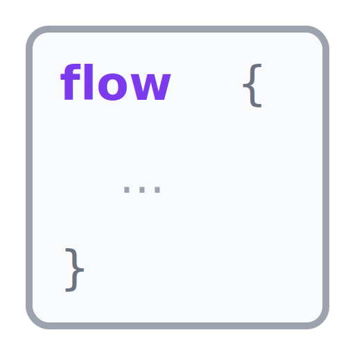

# Axial

<picture>
  <source media="(prefers-color-scheme: dark)" srcset="docs/content/img/axial-readme-dark.svg">
  <source media="(prefers-color-scheme: light)" srcset="docs/content/img/axial-readme-light.svg">
  
</picture>

Axial is a set of F# libraries for two common application problems:

- turning untrusted input into domain values without constructing a failed model;
- composing async work while keeping dependencies and expected failures visible.

Use either part on its own.

[](https://github.com/adz/Axial/actions/workflows/ci.yml)
[](https://www.nuget.org/packages/Axial)
[](LICENSE)

> [!WARNING]
> Axial 0.7.0 is the first planned release under the Axial name. It replaces the former monolithic FsFlow package with
> smaller packages. The public surface is still pre-1.0 and may change.

## Parse input into domain values

A schema describes fields, parsing, constraints, and construction in one value:

```fsharp
open Axial.Schema
open Axial.Schema.Syntax

type Signup =
    { Email: string
      Age: int }

let signupSchema =
    Schema.define<Signup>
    |> fieldWith (Schema.text
         |> Schema.constrainAll [ Constraint.required; Constraint.email ]) "email" _.Email
    |> fieldWith (Schema.int |> Schema.constrain (Constraint.atLeast 13)) "age" _.Age
    |> construct (fun email age -> { Email = email; Age = age })

match (Schema.parse signupSchema rawInput).Result with
| Ok signup -> register signup
| Error diagnostics -> display diagnostics
```

`Schema.parse` either returns the model or path-aware diagnostics. The same declaration can drive checking, JSON
Schema, compiled codecs, form redisplay, test-data generation, and versioned wire contracts.

A schema only controls values produced through the schema. When every value of a type must satisfy an invariant, use a
private representation and expose a fallible constructor or named domain operations.

Start here:

- [Schema overview](docs/landing/schema.md)
- [Getting started with Schema](docs/schema/getting-started.md)
- [Construction guarantees](docs/schema/trusted-construction.md)
- [Recommended Schema patterns](docs/schema/patterns/_index.md)
- [Versioned wire contracts](docs/schema/contracts.md)

Install the core package:

```bash
dotnet add package Axial.Schema
```

## Keep workflow dependencies visible

`Flow<'env, 'error, 'value>` describes async work, its dependencies, and its expected failure type:

```fsharp
open Axial.Flow

type RegistrationError =
    | UserNotFound
    | SaveFailed of string

type RegistrationEnv =
    { LoadUser: int -> Task<Result<User, RegistrationError>>
      SaveUser: User -> Task<Result<unit, RegistrationError>> }

let register userId : Flow<RegistrationEnv, RegistrationError, unit> =
    flow {
        let! loadUser = Flow.read _.LoadUser
        let! saveUser = Flow.read _.SaveUser
        let! user = loadUser userId
        return! saveUser user
    }
```

Tests supply a small record of fakes. The application host supplies live implementations. Cancellation, resource
scopes, retries, and child fibers stay within the workflow runtime.

Start here:

- [Flow overview](docs/landing/flow.md)
- [Getting started with Flow](docs/flow/getting-started.md)
- [Dependencies](docs/flow/services-and-runtimes/dependencies.md)
- [Service-provider boundaries](docs/flow/services-and-runtimes/service-provider-boundaries.md)

Install Flow:

```bash
dotnet add package Axial.Flow
```

## Plain Result remains the simple option

Small functions do not need schemas or workflows. `Axial.ErrorHandling` adds reusable checks and focused helpers while
keeping ordinary `Result<'value, 'error>` in your interfaces.

```fsharp
open Axial.ErrorHandling

let requireName value =
    value
    |> Check.String.present
    |> Result.orError NameMissing
```

- [Error Handling overview](docs/error-handling/_index.md)
- [Checks and Result](docs/error-handling/getting-started.md)
- [Refined domain values](docs/error-handling/refined/domain-values.md)

## Platforms and examples

The authored schema and workflow paths avoid runtime reflection. The core packages support NativeAOT, trimming, and
Fable; individual host and service packages document their supported targets.

- [Documentation](docs/index.md)
- [Runnable examples](examples/README.md)
- [Reference application](examples/Axial.ReferenceApp/README.md)
- [Packages and generated reference](docs/reference-indexes/)
