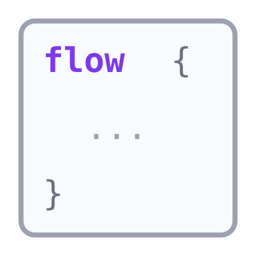

# Axial

<picture>
  <source media="(prefers-color-scheme: dark)" srcset="docs/content/img/axial-readme-dark.svg">
  <source media="(prefers-color-scheme: light)" srcset="docs/content/img/axial-readme-light.svg">
  
</picture>

Write asynchronous F# workflows whose expected failures and required dependencies are visible in their types.

[](https://github.com/adz/Axial/actions/workflows/ci.yml)
[](LICENSE)

> [!WARNING]
> Axial is pre-1.0 and its API may change before the first stable release.

## Your first flow

A handler often needs services and can fail, but ordinary `Task` signatures show neither fact. `Flow<'env, 'error, 'value>` makes both part of the contract.

```fsharp
open Axial

type RegistrationError =
    | UserNotFound
    | SaveFailed of string

type RegistrationEnv =
    { LoadUser: int -> Task<Result<User, RegistrationError>>
      SaveUser: User -> Task<Result<unit, RegistrationError>> }

let register userId : Flow<RegistrationEnv, RegistrationError, unit> =
    flow {
        let! loadUser = Flow.read _.LoadUser
        let! saveUser = Flow.read _.SaveUser
        let! user = loadUser userId
        return! saveUser user
    }
```

The application supplies live functions. A test supplies a small record of fakes. The workflow stays unchanged.

Flow also carries cancellation, resource scopes, concurrency, retries, scheduling, streams, and structured child fibers through the same runtime.

## Install

```bash
dotnet add package Axial
```

## Packages

The core is independent. Add service and hosting packages only when the workflow uses them.

- `Axial` — workflows, typed failures, dependencies, concurrency, schedules, streams, and layers
- `Axial.PlatformService` — explicit clock, logging, randomness, GUID, and environment services
- `Axial.Console`, `Axial.FileSystem`, `Axial.HttpClient`, `Axial.Process` — mockable operational services
- `Axial.Hosting`, `Axial.Hosting.Node`, `Axial.Hosting.Browser` — application lifecycle integrations
- `Axial.Telemetry` — tracing and runtime observability
- `Axial.Hosting.AspNetCore`, `Axial.Hosting.GenHttp` — optional adapters for serving Reified HTTP contracts

## Documentation and examples

- [Getting started](docs/01-getting-started/_index.md)
- [Dependencies and services](docs/04-dependencies/_index.md)
- [Failures and defects](docs/05-error-handling/_index.md)
- [Concurrency](docs/06-concurrency-and-state/_index.md)
- [HTTP client](docs/11-http/_index.md)
- [Runnable examples](docs/12-testing/runnable-examples.md)
- [Integration reference application](examples/Axial.ReferenceApp/README.md)

## Reified integration

[Reified](https://github.com/adz/Reified) declares value, model, JSON, and HTTP contracts. Axial's optional server adapters execute Reified HTTP contracts as workflows; neither core depends on the other.

Declare a contract with Reified. Serve it with Axial.
