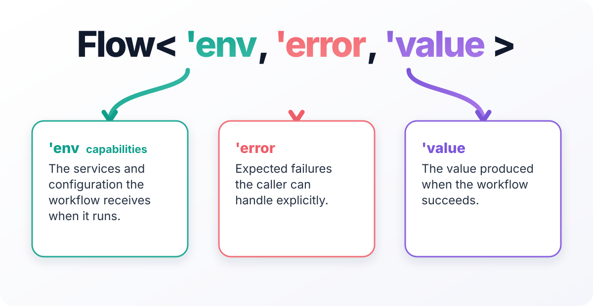
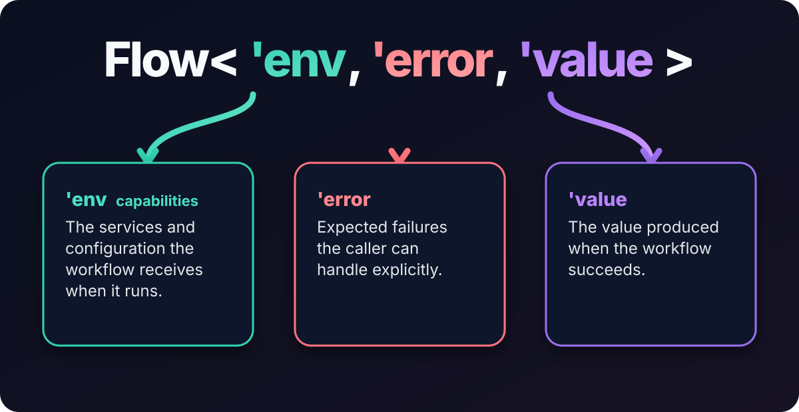

# Get started

## Before you begin

Install the [.NET SDK](https://dotnet.microsoft.com/download) 8.0 or later, then install Axial:

```bash
dotnet add package Axial
```

## The smallest Flow

Put this in a project that references `Axial`, or save it as `first-flow.fsx` with `#r "nuget: Axial"` as the first
line and run `dotnet fsi first-flow.fsx`:

```fsharp
open Axial

let ready : Flow<string> =
    Flow.succeed "The application is ready."

let result = Flow.run () ready
printfn "%A" result
```

The output is:

```text
Success "The application is ready."
```

`ready` describes work; it has not started. `Flow.run ()` is the edge that starts it. `Flow<string>` is the short
spelling for a Flow with no capabilities and no expected failure: `Flow<unit, Never, string>`.

<div class="flow-type-diagram">


</div>

Here, `unit` means no capabilities and `Never` means no expected failure. A capability is a value the workflow is
allowed to use—usually a service dependency, but sometimes configuration or request context. Only `string` carries
information here, so the alias keeps the first signature uncluttered.

You do not need to carry those two empty slots around until the workflow needs them. The next example does.

## A useful Flow: quote a price

Suppose the application already has an exchange-rate service. The service is ordinary application code: its live
implementation might call an API, use a cache, or dispatch to another service. Axial does not construct it and does
not need to know how it works.

The workflow names the one service it needs and turns the service's cancellable `Task<Result<_, _>>` operation into a
Flow:

```fsharp no-check reason="IExchangeRates is an application service implemented and registered by the host."
open System
open System.Threading
open System.Threading.Tasks

type QuoteError =
    | RateUnavailable

type IExchangeRates =
    abstract UsdToAud : CancellationToken -> Task<Result<decimal, QuoteError>>

type QuoteApp =
    { ExchangeRates: IExchangeRates }

let quoteAud (usd: decimal) : Flow<QuoteApp, QuoteError, decimal> =
    flow {
        let! rates = Flow.envWith _.ExchangeRates
        let! rate = ColdTask rates.UsdToAud
        return Math.Round(usd * rate, 2)
    }
```

The type reads as a contract: `quoteAud` needs `QuoteApp`, can fail with `QuoteError`, and otherwise returns a decimal.
The caller does not pass a cancellation token; `ColdTask` receives the one owned by the Flow runtime and gives it to
the service.

At the host edge, build the small capability record from services the application already owns:

```fsharp no-check reason="The host application owns the DI container and exchange-rate implementation."
let quoteApp (services: IServiceProvider) : QuoteApp =
    { ExchangeRates = services.GetRequiredService<IExchangeRates>() }

let exit = quoteAud 80m |> Flow.run (quoteApp services)
```

That is not a second dependency-injection system. It is the explicit value passed to the workflow boundary. In a
test, supply an `IExchangeRates` test implementation; in production, resolve the application's registered
implementation. The workflow remains exactly the same.

## What's next

1. [Why Flow?](why-flow.html) explains when this model earns its cost and when `Result` or `Task` is still the
   right answer.
2. [Installation and packages](installation.html) covers the package map.
3. [Add Axial to an existing Task application](existing-task-application.html) shows the one-module adoption path.
4. [Your first application](first-application.html) runs a Flow as an application root.
5. [Creating and running flows](../the-flow-type/index.html) covers the full construction and execution surface.
6. [Expected errors and defects](../error-handling/index.html) explains the error channel and defects.
7. [Dependencies, services, and layers](../dependencies/index.html) scales the environment record up.
