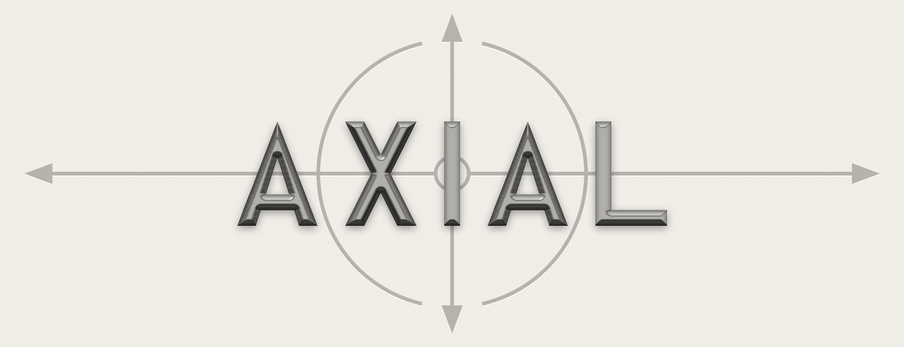
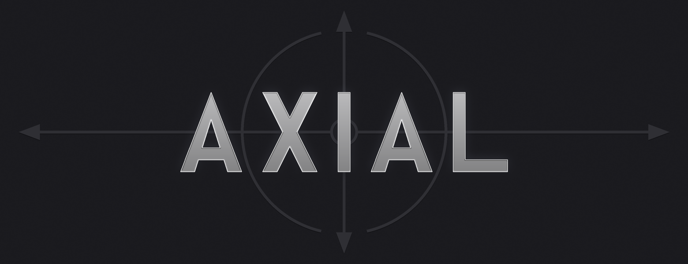

Typed asynchronous workflows for F#
<h1>One signature instead of four arguments.</h1>

Without Axial
<pre><code class="language-fsharp">val loadUser:
    cancellationToken: CancellationToken -&gt;
    services: AppServices -&gt;
    userId: UserId -&gt;
        Task&lt;Result&lt;User, LoadUserError&gt;&gt;</code></pre>

With Axial
<pre><code class="language-fsharp">val loadUser:
    UserId -&gt; Flow&lt;AppServices, LoadUserError, User&gt;</code></pre>

Cancellation, dependencies, and expected failures stop being extra arguments the caller has to thread through. They become part of the type.

Pass a workflow a plain record and get typed failures, cancellation, resource scopes, and structured concurrency. There is no container and no registration step. Axial adds retries, streams, STM, operational services, hosting, and telemetry over the same workflow model.

<a class="btn btn-primary" href="getting-started/index.html">Run your first workflow</a>

Axial is pre-1.0. Its API can change before the first stable release.

<a class="docs-chip" href="getting-started/index.html">Documentation</a>
<a class="docs-chip" href="https://github.com/adz/Axial">GitHub</a>
<a class="docs-chip" href="https://github.com/adz/Reified">Reified</a>

