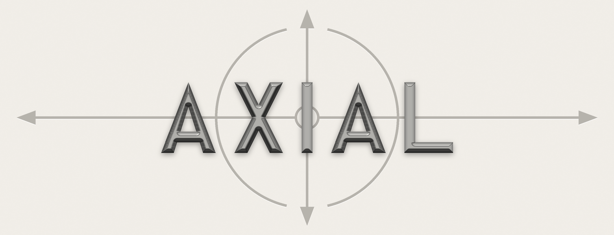
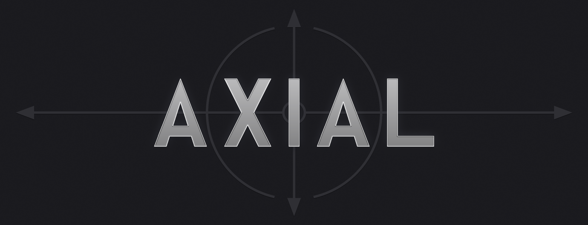

<div class="docs-home-container axial-landing">
<div class="docs-home-hero">
<div class="docs-home-copy">
<span class="eyebrow">Typed asynchronous workflows for F#</span>
<div class="docs-home-hero-visual">


</div>
<h1>Make the safe path the easy path.</h1>
<div class="lede">
<p><code>Flow</code> is one type for application work that runs asynchronously, can fail, can be cancelled, and uses services. Axial's runtime cancels, cleans up, and retries that work by the same rules everywhere, and the type says what the work needs.</p>
</div>
<p><a class="btn btn-primary" href="getting-started/index.html">Run your first workflow</a> <a class="btn btn-secondary" href="getting-started/why-flow.html">Why Flow?</a></p>
</div>
</div>

<div class="why-panels">

<section class="why-panel">
<div class="why-panel-head"><span class="why-number">1</span><h2>Async work and expected errors in one type</h2></div>
<p>With <code>Task&lt;Result&lt;_, _&gt;&gt;</code>, every step matches the result before the next can run. In <code>flow { }</code>, <code>let!</code> stops at the first expected error, and an exception becomes a defect in the outcome instead of escaping. FsToolkit.ErrorHandling's <code>taskResult { }</code> removes the same nesting, but the result is still <code>Task</code> code, with cancellation and cleanup handled by hand. The next points cover those.</p>
<div class="why-compare">
<div class="why-side why-side--before"><span class="why-side-label">Task</span>

```fsharp no-check reason="Shortened from the checked examples on the Why Flow page"
task {
    match! loadCart id with
    | Error e -> return Error e
    | Ok cart ->
        match! charge cart with
        | Error e -> return Error e
        | Ok payment ->
            return Ok(receipt cart payment)
}
```

</div>
<div class="why-side why-side--after"><span class="why-side-label">Flow</span>

```fsharp no-check reason="Shortened from the checked examples on the Why Flow page"
flow {
    let! cart = loadCart id
    let! payment = charge cart
    return receipt cart payment
}
```

</div>
</div>
</section>

<section class="why-panel">
<div class="why-panel-head"><span class="why-number">2</span><h2>Cancellation is handled the same way everywhere</h2></div>
<p>A flow takes no cancellation token. When one of two parallel loads fails, the other is interrupted. When the time limit passes, both are, and what they acquired is released before the timeout returns. Forked work belongs to the flow that started it, so nothing outlives a cancelled request.</p>
<div class="why-compare">
<div class="why-side why-side--before"><span class="why-side-label">Task</span>

```fsharp no-check reason="Shortened from the checked examples on the Why Flow page"
use cts =
    CancellationTokenSource
        .CreateLinkedTokenSource token
cts.CancelAfter(TimeSpan.FromSeconds 2.0)
let profile = loadProfile user cts.Token
let orders = loadOrders user cts.Token
// one failing does not stop the other
do! Task.WhenAll(profile :> Task, orders)
```

</div>
<div class="why-side why-side--after"><span class="why-side-label">Flow</span>

```fsharp no-check reason="Shortened from the checked examples on the Why Flow page"
Flow.zipPar
    (loadProfile user)
    (loadOrders user)
|> Flow.timeout
    (TimeSpan.FromSeconds 2.0)
    DashboardTimedOut
```

</div>
</div>
</section>

<section class="why-panel">
<div class="why-panel-head"><span class="why-number">3</span><h2>Dependencies in the signature mark the boundaries</h2></div>
<p>A flow's first type parameter names the services it uses. <code>reserveStock</code> can reach inventory and nothing else, so the compiler shows where one area of the application calls into another, and a test supplies only what the flow names.</p>
<div class="why-compare">
<div class="why-side why-side--before"><span class="why-side-label">Task</span>

```fsharp no-check reason="Shortened from the checked examples on the Why Flow page"
// Which services does it use?
// The signature does not say.
val checkout:
    Cart -> CancellationToken
    -> Task<Result<Receipt, OrderError>>
```

</div>
<div class="why-side why-side--after"><span class="why-side-label">Flow</span>

```fsharp no-check reason="Shortened from the checked examples on the Why Flow page"
val reserveStock: Cart ->
    Flow<Inventory, OrderError, Reservation>
val chargeCard: Cart ->
    Flow<Billing, OrderError, Payment>
val placeOrder: Cart ->
    Flow<Shop, OrderError, Receipt>
```

</div>
</div>
</section>

<section class="why-panel">
<div class="why-panel-head"><span class="why-number">4</span><h2>Time, randomness, and IDs are services too</h2></div>
<p>Reading the clock or making a GUID adds that service to the flow's type, and the requirement carries up to every caller. The application supplies the live services; a test supplies fixed ones and gets the same result every run.</p>
<div class="why-compare">
<div class="why-side why-side--before"><span class="why-side-label">Task</span>

```fsharp no-check reason="Shortened from the checked examples on the Why Flow page"
// A different result on every run,
// and nothing in the type says why.
{ Id = Guid.NewGuid()
  PlacedAt = DateTimeOffset.UtcNow }
```

</div>
<div class="why-side why-side--after"><span class="why-side-label">Flow</span>

```fsharp no-check reason="Shortened from the checked examples on the Why Flow page"
flow {
    let! placedAt = Clock.now
    let! id = Guid.newGuid
    return { Id = id; PlacedAt = placedAt }
}
// needs: 'env :> IHasClock and IHasGuid
```

</div>
</div>
</section>

<div class="why-minis">

<section class="why-panel why-mini">
<div class="why-panel-head"><span class="why-number">5</span><h2>Resources belong to their scope</h2></div>
<p>A helper can open a connection and return it. It closes when the caller's scope ends, in reverse order, however the scope ends.</p>

```fsharp no-check reason="Shortened from the checked examples on the Why Flow page"
flow {
    let! orders = connect "orders"
    let! billing = connect "billing"
    return summarise orders billing
}
|> Flow.scoped
```

</section>

<section class="why-panel why-mini">
<div class="why-panel-head"><span class="why-number">6</span><h2>Streams keep the same rules</h2></div>
<p>Four workers at a time; once ten pages arrive, the rest are interrupted and their resources released.</p>

```fsharp no-check reason="Shortened from the checked examples on the Why Flow page"
FlowStream.fromSeq pageIds
|> FlowStream.mapFlowPar
    (Parallelism.bounded 4) fetchPage
|> FlowStream.take 10
|> FlowStream.runCollect
```

</section>

<section class="why-panel why-mini">
<div class="why-panel-head"><span class="why-number">7</span><h2>You can see what is running</h2></div>
<p>Every fiber has an id, a parent, and a name. A registry lists the live ones; telemetry turns them into spans and metrics.</p>

```fsharp no-check reason="Shortened from the checked examples on the Why Flow page"
poll
|> Flow.forkNamed "outbox-poller"
|> Flow.annotate "tenant" "acme"
|> Flow.withFiberRegistry registry
// registry.DumpAt(clock) lists live fibers
```

</section>

</div>

<section class="why-panel">
<div class="why-panel-head"><span class="why-number">8</span><h2>Fewer states to reason about, for people and for LLMs</h2></div>
<p>Every flow ends in one of three ways. Concurrency follows fixed rules instead of per-call-site choices, and the build reports the shortcuts the types cannot rule out. A reviewer, or an LLM coding assistant, has fewer cases to consider and gets told about the usual mistakes.</p>
<div class="why-outcomes" aria-label="The three ways a flow ends">
<span class="why-outcome why-outcome--value">Value</span>
<span class="why-outcome why-outcome--error">Expected error, named in the type</span>
<span class="why-outcome why-outcome--defect">Defect or interruption</span>
</div>
<ul class="why-rules">
<li>Forked work belongs to the scope that started it.</li>
<li>Cancellation always arrives as an interruption.</li>
<li>Resources are released in reverse order, however the scope ends.</li>
<li>Axial.Guardrails reports direct clock and randomness calls, exceptions raised in <code>flow { }</code>, and dropped cancellation tokens.</li>
</ul>
</section>

</div>

<div class="docs-home-example" aria-label="Axial dependency and runtime model">
<span class="docs-home-example-label">How it fits together</span>
<div class="axial-coord">
<div class="axial-coord-col axial-coord-col--left">
<span class="axial-coord-label">Typed environment</span>
<div class="coord-row"><span class="coord-pill">Application record</span><span class="coord-line"></span></div>
<div class="coord-row"><span class="coord-pill">Clock</span><span class="coord-line"></span></div>
<div class="coord-row"><span class="coord-pill">HTTP</span><span class="coord-line"></span></div>
<div class="coord-row"><span class="coord-pill">File system</span><span class="coord-line"></span></div>
<div class="coord-row"><span class="coord-pill">Process</span><span class="coord-line"></span></div>
<div class="coord-row"><span class="coord-pill">Your services</span><span class="coord-line"></span></div>
</div>
<div class="axial-coord-mid">
<div class="coord-hub">
<span>Flow&lt;'env, 'error, 'value&gt;</span>
</div>
</div>
<div class="axial-coord-col axial-coord-col--right">
<span class="axial-coord-label">Supplied at the edge</span>
<div class="coord-row"><span class="coord-line"></span><span class="coord-pill">Live services</span></div>
<div class="coord-row"><span class="coord-line"></span><span class="coord-pill">Test doubles</span></div>
<div class="coord-row"><span class="coord-line"></span><span class="coord-pill">.NET</span></div>
<div class="coord-row"><span class="coord-line"></span><span class="coord-pill">Browser</span></div>
<div class="coord-row"><span class="coord-line"></span><span class="coord-pill">Node</span></div>
</div>
</div>
<p class="axial-coord-caption">A workflow names the environment it needs. The caller supplies the implementation when it runs the workflow.</p>
</div>

## Built on Axial

### Process

Compose external commands and pipelines, stream output, and handle cancellation and failures through `Flow`.

[Read the Process documentation →](/process/)

### HTTP

Build typed requests, handle responses, and apply reliability policies through the same workflow model.

[Read the HTTP documentation →](/http/)

[View all packages →](/packages/)

<div class="docs-home-meta">
<a class="docs-chip" href="getting-started/index.html">Documentation</a>
<a class="docs-chip" href="https://github.com/adz/Axial">GitHub</a>
<a class="docs-chip" href="https://github.com/adz/Reified">Reified</a>
</div>
</div>
